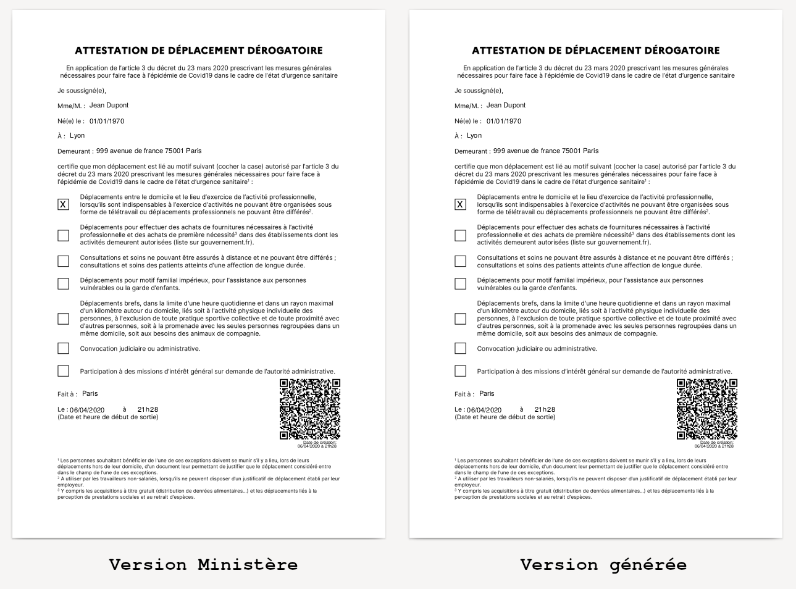

# Générateur d'attestation de déplacement dérogatoire COVID19

[Exemple d'attestation générée](exemples/attestation_exemple.pdf)

## Comment générer ?

Depuis votre console, à la racine du projet, tapez ``make clean ; make``.

Si vous n'avez pas de fichier de configuration, un assistant vous demandera de saisir les valeurs du formulaire (``make config`` permet de l’exécuter à la demande)

L'attestation généré se trouve à la racine du projet sous le nom ``attestation.pdf``

## Quelles dépendances ?

    apt-get install inkscape gettext-base python-qrcode pdftk make

### Existe-t-il une installation Docker ?

Oui, grace à @Kilhog !

Pour utiliser Docker, vous pouvez utilser la commande suivante pour lancer le make par l'intermédiaire de celui-ci :

    docker-compose up -d

N'oubliez pas de créer ou modifier le fichier de configuration ``config/config.inc`` avant d'executer la commande précédente.

## Peut-on utiliser un autre fichier de configuration que ``config/config.inc`` ?

Oui, le fichier de configuration est défini par la variable Makefile ``config_file``. Vous pouvez la surcharger (par ``config_courses.inc``dans cet exemple) ainsi :

    config_file=config/config_courses.inc make -e

Si le fichier n'existe pas, il sera créé via le générateur comme pour le fichier classique.

## Puis-je bancher ce code avec mon serveur web ?

Oui, un script ``cgi-bin`` est fourni dans ce dépot (``cgi-bin/attestation``). Il permet à serveur web comme ``apache2`` de générer une attestation à la demande.

Pour l'installer, il suffit de placer le script (via un lien symbolique) dans le répertoire dédié aux *cgi* (``/usr/lib/cgi-bin`` en général) :

    cd /usr/lib/cgi-bin
    ln -s /chemin/vers/attestation-covid19/cgi-bin/attestation attestation-covid19.sh

Vous pouvez maintenant générer une attestation à la demande via l'url dédiée à au script *cgi* :

    http://localhost/cgi-bin/attestation-covid19.sh

Si vous souhaitez utiliser un autre fichier de configuration que le fichier par défaut, vous pouvez passer le nom de ce fichier en paramètre du script :

    http://localhost/cgi-bin/attestation-covid19.sh?config_courses.inc

### Des difficultés avec ces histoires de cgi ?

Veillez à autoriser l'usage des liens symboliques dans la configuration de votre serveur web (directive ``Options +FollowSymLinks``) :

    ScriptAlias /cgi-bin/ /usr/lib/cgi-bin/
    <Directory "/usr/lib/cgi-bin">
            AllowOverride None
            Options +ExecCGI -MultiViews +FollowSymLinks
            Require all granted
    </Directory>

Vous pouvez également copier le fichier ``cgi-bin/attestation`` dans le répertoire dédié aux scripts *cgi*. Dans ce cas, veillez à modifier le début du script pour indiquer où se trouve le chemin vers le projet ``attestation-covid19`` et à bien donner le droit exécutable au script.

## Comment ca fonctionne ?

Le fichier Makefile vient remplir une version SVG de l'attestation du ministère de l'intérieur et un qr code contenant les informations attendues est généré.

## Y a-t-il des test ?

Oui :)

Il faut installer les dépendances suivantes afin de décoder le qrcode et comparer les deux pdf :

    apt-get install imagemagick perceptualdiff zbar-tools diffutils

Puis, vous pouver lancer les tests :

    make test

Si les qrcodes générés retournent le même résultat que ceux du PDF original et que le document généré a peu de différences visuelles avec l'original (moins de 1200 pixels de différences par page), les tests seront jugés concluants.
